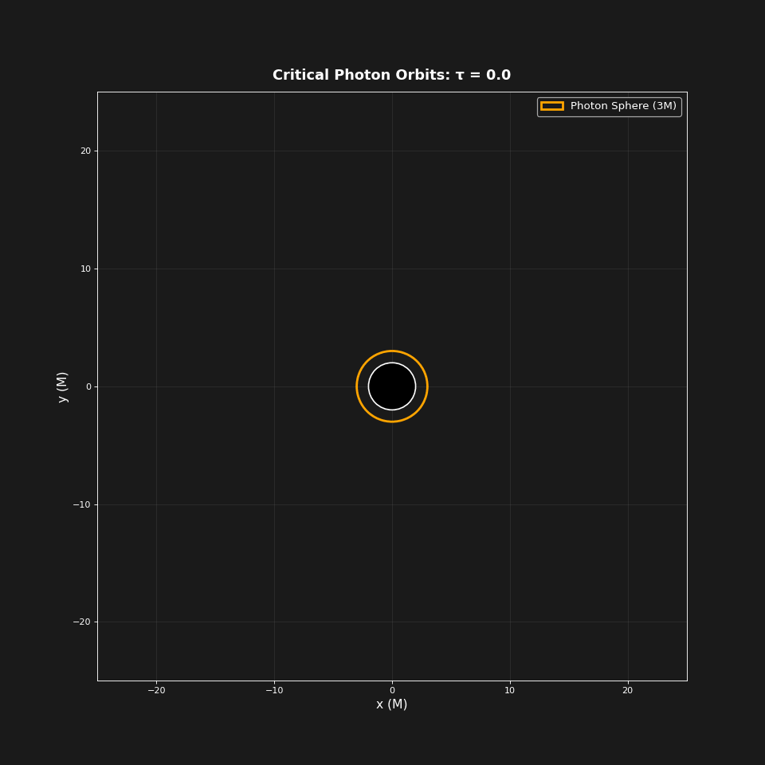
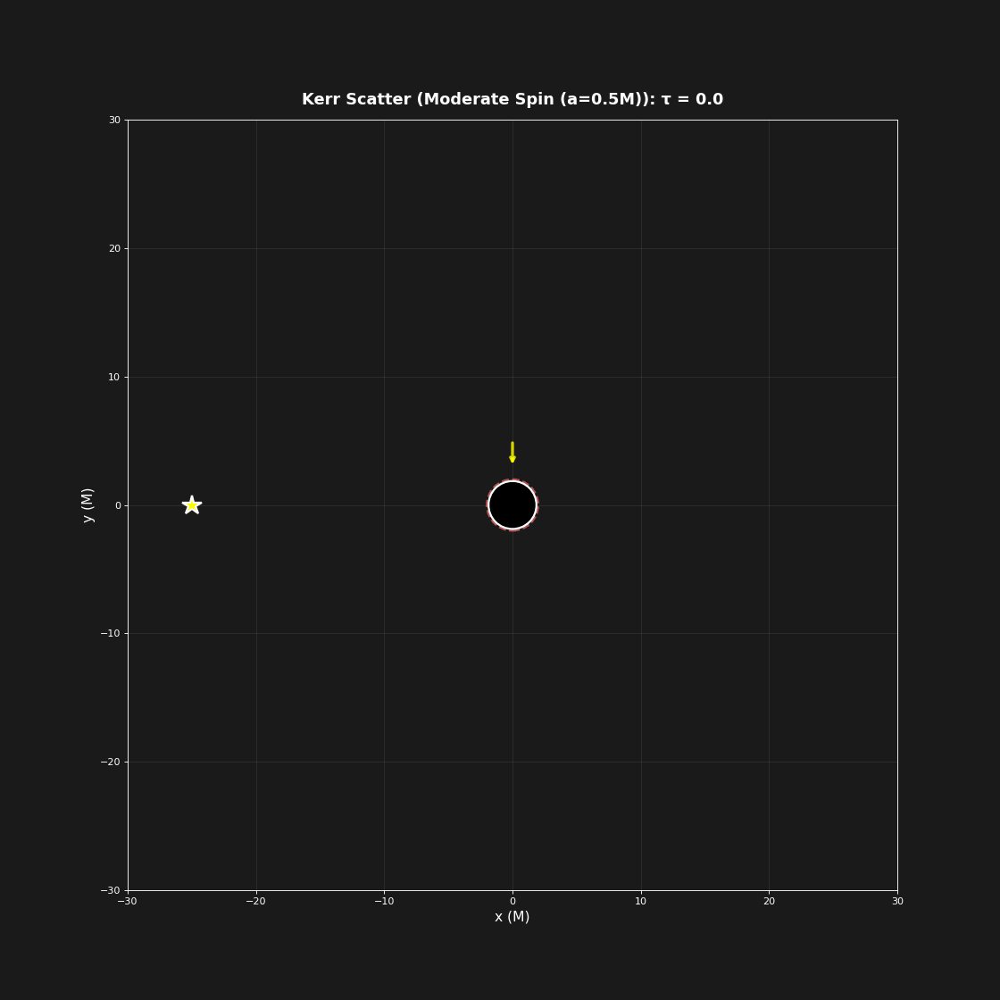
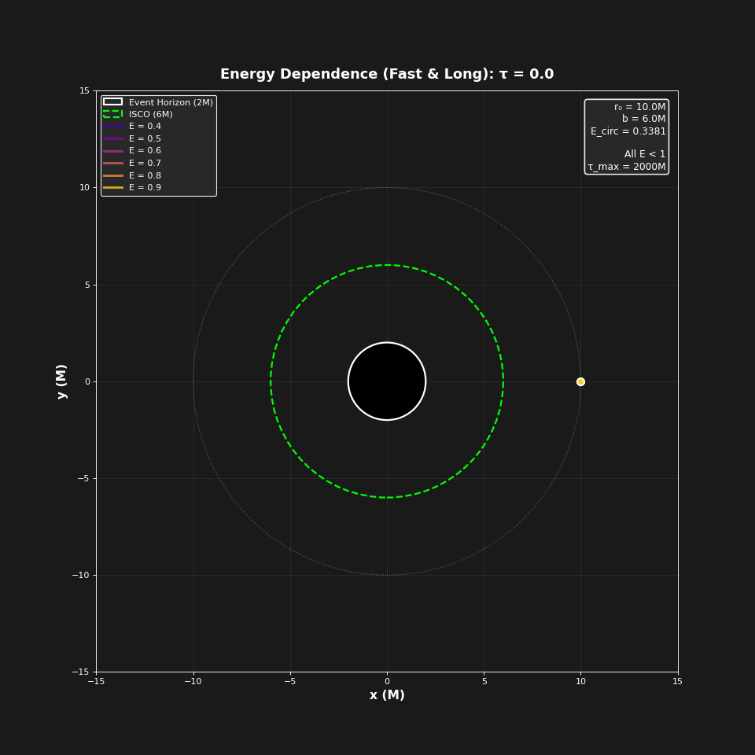

# Black Hole Geodesic Simulator

A high-performance Python simulator for computing and visualizing particle trajectories (geodesics) around Schwarzschild and Kerr black holes. This project implements the full general relativistic equations of motion for both massive particles and photons in curved spacetime.

---

## Demonstrations


### Schwarzschild Black Hole - Photon Trajectories


### Kerr Black Hole - Frame Dragging Effect


### Massive Particle Orbits


---

## Table of Contents

- [Overview](#overview)
- [Features](#features)
- [Installation](#installation)
- [Quick Start](#quick-start)
- [Physics Background](#physics-background)
- [Usage Examples](#usage-examples)
- [API Reference](#api-reference)
- [Project Structure](#project-structure)
- [Performance](#performance)
- [Future Work](#future-work)
- [Contributing](#contributing)
- [License](#license)
- [Acknowledgments](#acknowledgments)

---

## Overview

This simulator numerically integrates geodesic equations in the Schwarzschild and Kerr metrics, enabling accurate modeling of:

- **Photon trajectories** (null geodesics) around black holes
- **Massive particle orbits** (timelike geodesics)
- **Gravitational lensing** and light bending
- **Frame dragging** effects in rotating black holes
- **Critical phenomena** near photon spheres and ISCOs

The implementation uses high-precision ODE integration (DOP853 method with adaptive stepping) and conserves energy and angular momentum to machine precision.

### Key Physics

- **Schwarzschild metric**: Non-rotating black holes with spherical symmetry
- **Kerr metric**: Rotating black holes with frame-dragging effects
- **Geodesic equations**: Derived from the geodesic equation $\frac{d^2x^\mu}{d\tau^2} + \Gamma^\mu_{\alpha\beta}\frac{dx^\alpha}{d\tau}\frac{dx^\beta}{d\tau} = 0$

---

## Features

### Black Hole Models
- **Schwarzschild metric** (non-rotating)
  - Photon sphere at $r = 3M$
  - ISCO at $r = 6M$ for massive particles
  - Critical impact parameter $b_{\text{crit}} = \sqrt{27}M$ for photons
  
- **Kerr metric** (rotating)
  - Adjustable spin parameter $a \in [0, M]$
  - Frame-dragging and ergosphere effects
  - Different behavior for co- and counter-rotating orbits

### Particle Types
- **Null geodesics** (photons): massless particles traveling at the speed of light
- **Timelike geodesics** (massive particles): particles with rest mass and sub-light velocities

### Integration Features
- High-precision integration using `scipy.integrate.solve_ivp` (DOP853 method)
- Adaptive time-stepping for optimal accuracy
- Event detection for horizon crossings and escape
- Conservation of energy and angular momentum
- Configurable tolerance levels (default: `rtol=1e-9`, `atol=1e-12`)

### Simulation Modes
1. **Single trajectory**: Simulate one particle with specified initial conditions
2. **Parameter sweep**: Systematic exploration of impact parameter space
3. **Random ensemble**: Monte Carlo-style sampling of phase space
4. **Scattering experiments**: Study deflection angles and cross-sections

---

## Installation

### Requirements

- Python 3.8+
- NumPy >= 1.20
- SciPy >= 1.7
- Matplotlib >= 3.4 (for visualization)

### Install Dependencies

```bash
pip install numpy scipy matplotlib
```

### Clone Repository

```bash
git clone https://github.com/fynnhufler/General-Relativity-Simulations.git
cd General-Relativity-Simulations
```

---

## Quick Start

### Example 1: Photon Trajectories Around Schwarzschild Black Hole

```python
import numpy as np
import sys
sys.path.append('src')

from geodesics import SchwarzschildMetric, GeodesicSimulation

# Create a Schwarzschild black hole with mass M=1
metric = SchwarzschildMetric(mass=1.0)

# Initialize simulation
sim = GeodesicSimulation(metric)

# Define impact parameters around the critical value
b_crit = metric.critical_impact_parameter(is_timelike=False)
impact_params = np.linspace(b_crit * 0.8, b_crit * 1.2, 5)

# Simulate photon bundle
trajectories = sim.simulate_bundle(
    r0=15.0,  # Start at r = 15M
    impact_params=impact_params,
    is_timelike=False,  # Photons
    tau_span=(0, 100),
    radial_direction="tangent"
)

# Plot results (requires matplotlib)
import matplotlib.pyplot as plt

fig, ax = plt.subplots(figsize=(10, 10))
for traj in trajectories:
    ax.plot(traj.x, traj.y, label=traj.label)

# Add event horizon
circle = plt.Circle((0, 0), 2*metric.M, color='black', label='Event Horizon')
ax.add_patch(circle)

ax.set_aspect('equal')
ax.legend()
ax.grid(True, alpha=0.3)
plt.show()
```

### Example 2: Massive Particle Orbit

```python
# Create simulation with massive particle
sim = GeodesicSimulation(SchwarzschildMetric(mass=1.0))

# Simulate bound orbit
trajectory = sim.simulate(
    r0=10.0,              # Initial radius
    impact_param=6.5,     # Impact parameter
    is_timelike=True,     # Massive particle
    E=0.95,               # Energy (< 1 for bound orbit)
    tau_span=(0, 200),
    radial_direction="tangent"
)

print(f"Orbit completed {len(trajectory)} integration steps")
print(f"Final radius: {trajectory.r[-1]:.2f} M")
```

### Example 3: Kerr Black Hole with Spin

```python
import sys
sys.path.append('src')

from geodesics import KerrMetric, GeodesicSimulation

# Create rotating black hole (spin = 0.7)
kerr = KerrMetric(mass=1.0, spin=0.7)

sim = GeodesicSimulation(kerr)

# Simulate co-rotating photon
trajectory = sim.simulate(
    r0=10.0,
    impact_param=5.0,
    is_timelike=False,
    tau_span=(0, 100),
    radial_direction="tangent"
)
```

> **Note**: The project includes several ready-to-run simulation scripts in the `src/` directory:
> - `simulations.py` - Main simulation orchestration
> - `kerr_simulations.py` - Kerr black hole specific simulations  
> - `more_simulations.py` - Additional scenarios
> - `static_plots.py` - Generate publication-ready figures
> 
> Check the `results/` folder for generated plots and videos!

---

## Physics Background

### Schwarzschild Metric

The Schwarzschild solution describes the spacetime geometry around a non-rotating, spherically symmetric black hole:

$$ds^2 = -\left(1 - \frac{2M}{r}\right)dt^2 + \frac{dr^2}{1 - \frac{2M}{r}} + r^2(d\theta^2 + \sin^2\theta \, d\phi^2)$$

**Key radii:**
- Event horizon: $r_s = 2M$
- Photon sphere: $r_{\text{photon}} = 3M$
- ISCO (timelike): $r_{\text{ISCO}} = 6M$

### Kerr Metric

The Kerr solution describes rotating black holes with angular momentum:

$$ds^2 = -\left(1 - \frac{2Mr}{\Sigma}\right)dt^2 - \frac{4Mar\sin^2\theta}{\Sigma}dtd\phi + \frac{\Sigma}{\Delta}dr^2 + \Sigma d\theta^2 + \frac{A\sin^2\theta}{\Sigma}d\phi^2$$

where:
- $\Sigma = r^2 + a^2\cos^2\theta$
- $\Delta = r^2 - 2Mr + a^2$
- $A = (r^2 + a^2)^2 - a^2\Delta\sin^2\theta$
- $a = J/M$ is the spin parameter

**Key features:**
- Outer horizon: $r_+ = M + \sqrt{M^2 - a^2}$
- Inner horizon: $r_- = M - \sqrt{M^2 - a^2}$
- Ergosphere: $r_{\text{ergo}} = M + \sqrt{M^2 - a^2\cos^2\theta}$

### Geodesic Equations

Geodesics satisfy:

$$\frac{d^2x^\mu}{d\tau^2} + \Gamma^\mu_{\alpha\beta}\frac{dx^\alpha}{d\tau}\frac{dx^\beta}{d\tau} = 0$$

where $\Gamma^\mu_{\alpha\beta}$ are the Christoffel symbols derived from the metric.

### Conserved Quantities

For stationary, axisymmetric spacetimes (both Schwarzschild and Kerr):
- **Energy**: $E = -p_t$ (conserved due to time translation symmetry)
- **Angular momentum**: $L = p_\phi$ (conserved due to rotational symmetry)

These conservation laws are used to set initial conditions and verify numerical accuracy.

### Critical Impact Parameters

**Schwarzschild photons**: $b_{\text{crit}} = \sqrt{27}M \approx 5.196M$
- $b > b_{\text{crit}}$: photon escapes (deflected)
- $b < b_{\text{crit}}$: photon is captured
- $b = b_{\text{crit}}$: photon orbits at $r = 3M$

**Schwarzschild massive particles**: $b_{\text{crit}} \approx 4M$ (approximate)

---

## Usage Examples

### Advanced: Parameter Sweep Analysis

```python
import numpy as np
import sys
sys.path.append('src')

from geodesics import SchwarzschildMetric, GeodesicSimulation

metric = SchwarzschildMetric(mass=1.0)
sim = GeodesicSimulation(metric)

# Critical impact parameter
b_crit = metric.critical_impact_parameter(is_timelike=False)

# Fine sweep around critical value
impact_params = np.linspace(b_crit * 0.95, b_crit * 1.05, 20)

trajectories = sim.simulate_bundle(
    r0=20.0,
    impact_params=impact_params,
    is_timelike=False,
    tau_span=(0, 150),
    radial_direction="tangent"
)

# Analyze capture/escape statistics
captured = sum(1 for t in trajectories if t.r[-1] < 5*metric.M)
escaped = sum(1 for t in trajectories if t.r[-1] > 50*metric.M)

print(f"Captured: {captured}/{len(trajectories)}")
print(f"Escaped: {escaped}/{len(trajectories)}")
```

### Random Ensemble Simulation

```python
import sys
sys.path.append('src')

from geodesics import SchwarzschildMetric, GeodesicSimulation

# Explore phase space with random initial conditions
sim = GeodesicSimulation(SchwarzschildMetric(mass=1.0))

trajectories = sim.simulate_random_bundle(
    n_particles=50,
    r_range=(5, 30),           # Initial radius range
    impact_range=(2, 10),      # Impact parameter range
    is_timelike=False,
    tau_span=(0, 100)
)

# Analyze outcomes
for i, traj in enumerate(trajectories):
    final_r = traj.r[-1]
    if final_r < 5:
        outcome = "captured"
    elif final_r > 50:
        outcome = "escaped"
    else:
        outcome = "orbiting"
    print(f"Trajectory {i+1}: {outcome}")
```

### Custom Initial Conditions

```python
import sys
sys.path.append('src')

from geodesics import SchwarzschildMetric, GeodesicIntegrator, Trajectory

# Manual control over initial state
metric = SchwarzschildMetric(mass=1.0)

initial_state = metric.get_initial_state(
    r0=10.0,                    # Initial radius
    phi0=0.0,                   # Initial angle
    impact_param=5.5,           # Impact parameter
    is_timelike=False,          # Photon
    E=1.0,                      # Energy
    radial_direction="inward"   # Initial radial motion
)

# Integrate manually
integrator = GeodesicIntegrator(metric)
solution = integrator.integrate(
    initial_state=initial_state,
    tau_span=(0, 100),
    is_timelike=False,
    max_step=0.1
)

# Extract trajectory
traj = Trajectory.from_solution(solution, is_timelike=False)
```

---

## API Reference

### Metric Classes

#### `SchwarzschildMetric(mass=1.0)`

Schwarzschild spacetime for non-rotating black holes.

**Attributes:**
- `M`: Black hole mass
- `r_s`: Schwarzschild radius ($2M$)
- `r_photon`: Photon sphere radius ($3M$)
- `r_isco`: ISCO radius ($6M$)
- `b_crit_photon`: Critical impact parameter for photons
- `b_crit_massive`: Critical impact parameter for massive particles

**Methods:**
- `metric_factor(r)`: Returns $f(r) = 1 - 2M/r$
- `critical_impact_parameter(is_timelike)`: Returns critical $b$ for capture
- `geodesic_equations(tau, state, is_timelike)`: Computes geodesic derivatives
- `get_initial_state(r0, phi0, impact_param, ...)`: Constructs initial conditions

#### `KerrMetric(mass=1.0, spin=0.5)`

Kerr spacetime for rotating black holes (equatorial plane).

**Parameters:**
- `mass`: Black hole mass $M$
- `spin`: Dimensionless spin $a/M \in [0, 1]$

**Attributes:**
- `a`: Angular momentum parameter ($= \text{spin} \times M$)
- `r_plus`: Outer horizon radius
- `r_minus`: Inner horizon radius
- `r_ergo`: Ergosphere radius at equator

**Methods:** (Similar to SchwarzschildMetric)

### Simulation Classes

#### `GeodesicSimulation(metric)`

High-level interface for running simulations.

**Methods:**

##### `simulate(r0, phi0, impact_param, is_timelike, E, tau_span, radial_direction, label)`

Simulate single particle trajectory.

**Parameters:**
- `r0` (float): Initial radius
- `phi0` (float): Initial angle [default: 0.0]
- `impact_param` (float): Impact parameter $b = L/E$
- `is_timelike` (bool): True for massive, False for photons
- `E` (float): Energy [default: auto-calculated]
- `tau_span` (tuple): Integration range [default: (0, 100)]
- `radial_direction` (str): "tangent", "inward", "outward", or "auto"
- `label` (str): Trajectory label

**Returns:** `Trajectory` object

##### `simulate_bundle(r0, impact_params, is_timelike, tau_span, radial_direction)`

Simulate multiple particles with different impact parameters.

**Parameters:**
- `impact_params` (array): Array of impact parameter values

**Returns:** List of `Trajectory` objects

##### `simulate_random_bundle(n_particles, r_range, impact_range, is_timelike, tau_span)`

Simulate random ensemble of particles.

**Parameters:**
- `n_particles` (int): Number of particles
- `r_range` (tuple): Initial radius range $(r_{\min}, r_{\max})$
- `impact_range` (tuple): Impact parameter range $(b_{\min}, b_{\max})$

**Returns:** List of `Trajectory` objects

### Trajectory Class

#### `Trajectory`

Stores computed geodesic trajectory.

**Attributes:**
- `tau`: Proper time array
- `t`: Coordinate time array
- `r`: Radial coordinate array
- `phi`: Angular coordinate array
- `x`, `y`: Cartesian coordinates
- `ut`, `ur`, `uphi`: Four-velocity components
- `vr_coord`, `vphi_coord`: Coordinate velocities
- `is_timelike`: Particle type flag
- `label`: Trajectory label

**Methods:**
- `__len__()`: Returns number of integration points
- `from_solution(solution, is_timelike, label)`: Create from integration result

---

## Project Structure

```
General-Relativity-Simulations/
├── README.md                          # This file
├── requirements.txt                   # Python dependencies
├── notebook/                          # Jupyter notebooks for analysis
├── presentation/                      # Project presentation materials
├── results/                           # Simulation outputs
│   ├── plots/                         # Generated plots and figures
│   └── videos/                        # Animation videos
└── src/                               # Source code
    ├── celestial_sphere.py            # Celestial sphere utilities
    ├── geodesics.py                   # Core geodesic computation
    ├── kerr_simulations.py            # Kerr black hole simulations
    ├── kerr_wider_spread.py           # Extended Kerr parameter studies
    ├── more_simulations.py            # Additional simulation scenarios
    ├── physical_test.py               # Physics validation tests
    ├── simulations.py                 # Main simulation orchestration
    └── static_plots.py                # Static visualization generation
```

---

## Performance

### Numerical Accuracy

- **Integration method**: Dormand-Prince 8(5,3) (DOP853)
  - 8th order accurate with adaptive stepping
  - Embedded error estimation
  
- **Default tolerances**:
  - Relative tolerance: `rtol = 1e-9`
  - Absolute tolerance: `atol = 1e-12`

- **Conservation laws**: Energy and angular momentum conserved to ~10⁻⁹ relative error

### Computational Speed

Typical performance on modern CPU (single core):

| Scenario | Integration Time | Points Generated |
|----------|------------------|------------------|
| Single photon orbit | ~50 ms | 500-1000 |
| Massive particle (100 τ) | ~80 ms | 800-1200 |
| Bundle simulation (20 particles) | ~1-2 seconds | 10,000-20,000 |
| Random ensemble (100 particles) | ~5-8 seconds | 50,000-100,000 |

### Optimization Tips

1. **Reduce integration span**: Use shorter `tau_span` for faster results
2. **Increase `max_step`**: Default is 0.1, can increase to 0.5 for coarser trajectories
3. **Lower tolerance**: For visualization, `rtol=1e-6` may suffice
4. **Parallel processing**: Use `multiprocessing` for bundle simulations

```python
from multiprocessing import Pool

def simulate_one(params):
    r0, b = params
    return sim.simulate(r0=r0, impact_param=b, ...)

with Pool(processes=4) as pool:
    results = pool.map(simulate_one, parameter_list)
```

---

## Future Work

### Planned Features

- [ ] **Testing suite**: Unit tests for conservation laws and known solutions
- [ ] **Example scripts**: Ready-to-run examples for common scenarios
- [ ] **Visualization tools**: Automated plotting and animation generation
- [ ] **Off-equatorial motion**: Extend to full 3D geodesics with θ-motion
- [ ] **Additional metrics**: Reissner-Nordström (charged) black holes
- [ ] **Performance optimization**: GPU acceleration and parallel processing
- [ ] **Interactive visualization**: Web-based interface for real-time exploration

### Validation Approach

The current implementation has been validated through:

1. **Newtonian limit**: At large distances ($r \gg M$), trajectories match Newtonian predictions
2. **Circular orbits**: Stable circular orbits verified at expected radii
3. **Conservation laws**: Energy and angular momentum conserved to ~10⁻⁹ relative error throughout integration
4. **Known solutions**: Photon sphere orbits ($r = 3M$) reproduced accurately
5. **Kerr → Schwarzschild**: With $a = 0$, Kerr results match Schwarzschild exactly
6. **Physical reasonableness**: All trajectories behave as expected (capture vs. escape based on impact parameter)

---

## Contributing

Contributions are welcome! This is an academic project that could benefit from:

**High Priority:**
- [ ] Example scripts demonstrating common use cases
- [ ] Visualization and animation utilities
- [ ] Test suite for numerical accuracy validation
- [ ] Documentation improvements

**Future Enhancements:**
- [ ] Off-equatorial geodesics (full 3D motion with θ)
- [ ] Reissner-Nordström metric (charged black holes)
- [ ] Gravitational wave perturbations
- [ ] GPU acceleration with CUDA/OpenCL
- [ ] Interactive web visualization
- [ ] Symplectic integrators for improved long-term stability

### Getting Started

```bash
git clone https://github.com/yourusername/General-Relativity-Simulations.git
cd black-hole-simulator
pip install numpy scipy matplotlib
```

Feel free to open issues for bugs, feature requests, or questions!

---

## License

This project is licensed under the MIT License - see the [LICENSE](LICENSE) file for details.

---

## Acknowledgments

- **Course**: PHY 387M – Relativity Theory 1, University of Texas at Austin
- **Instructor**: [Instructor Name]
- **References**:
  - Bardeen, J. M., Press, W. H., & Teukolsky, S. A. (1972). "Rotating Black Holes: Locally Nonrotating Frames, Energy Extraction, and Scalar Synchrotron Radiation." *The Astrophysical Journal*, 178, 347.
  - Misner, C. W., Thorne, K. S., & Wheeler, J. A. (1973). *Gravitation*. W. H. Freeman.
  - Carroll, S. M. (2004). *Spacetime and Geometry: An Introduction to General Relativity*. Addison-Wesley.

- **Numerical Methods**: SciPy's `solve_ivp` implementation
- **Visualization**: Matplotlib community

---

## Contact

**Author**: Fynn Hufler  
**Affiliation**: MSc Physics, University of Texas at Austin  
**Date**: December 3rd, 2025  
**Email**: [fhufler@ethz.ch]  
**GitHub**: [@yourusername](https://github.com/fynnhufler)

---

## Citation

If you use this code in your research, please cite:

```bibtex
@software{hufler2025blackhole,
  author = {Hufler, Fynn},
  title = {Black Hole Geodesic Simulator},
  year = {2025},
  url = {https://github.com/yourusername/General-Relativity-Simulations},
  note = {PHY 387M Project, University of Texas at Austin}
}
```

---